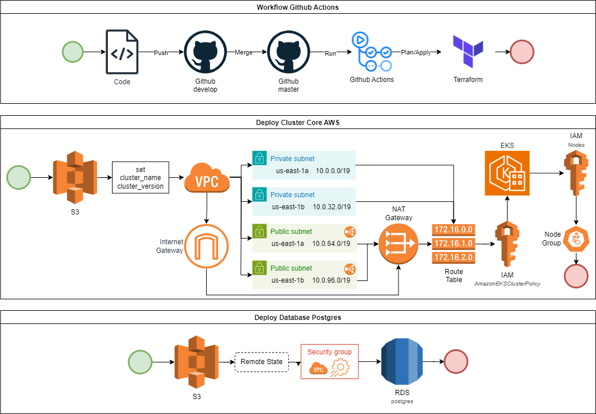
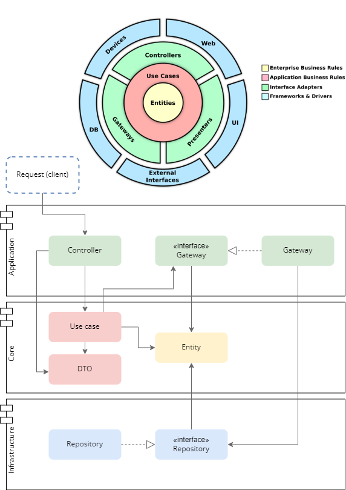
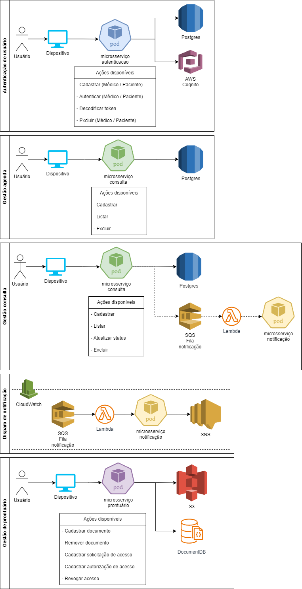

### FIAP - Hackathon 2024 - SOAT4 - Grupo 11 
- Alexandre Mikio Kimura Fukano - **RM 351127** (alexandremkimura@hotmail.com)
- Lucas Proença Renó - **RM 351351** (lucasreno9@gmail.com)
- Matheus Agusuto Leme Matiazzo - **RM 351128** (mathmatiazzo@gmail.com)
- Vinicius Carloto Carnelocce - **RM 351126** (viniciuscarloto@gmail.com)

---

### Links úteis
[-2024-blue?logo=readthedocs)](/assets/hackathon-soat.pdf)

 

## Sumário
1. [Identificação do problema](#identificação-do-problema)
2. [Domain Driven Design](#domain-driven-design)
3. [Diagramas](#diagramas)
    - [Modelo entidade-relacionamento](#1-modelo-entidade-relacionamento)
    - [Diagramas de sequência](#2-diagramas-de-sequência)
    - [Diagrama de status](#3-diagrama-de-status)
    - [Diagrama de fluxo](#4-diagrama-de-fluxo)
4. [Infraestrutura](#infraestrutura)
5. [Microsserviços](#microsserviços)
    - [Clean Architecture](#clean-architecture)
    - [Padrão SAGA](#padrão-saga)
6. [Controle de Qualidade](#controle-de-qualidade)
    - [Testes unitários](#testes-unitários)
    - [Testes de carga](#testes-de-carga)
    - [SonarQube](#sonarqube)
    - [Relatório OWASP ZAP](#relatório-owasp-zap)
7. [LGPD](#lgpd)
    - [Relatório de Impacto à Proteção de Dados](#relatório-de-impacto-à-proteção-de-dados)
8. [MVP](#mvp)

## Identificação do problema
Os estudos baseiam-se em uma startup de telemedicina, que viabiliza a realização de consultas médicas online. Nosso objetivo é criar um sistema eficiente e seguro para conectar médicos e pacientes. Com este sistema, os pacientes poderão agendar consultas. Além disso, os médicos terão acesso ao prontuário eletrônico dos pacientes, respeitando as permissões concedidas por eles. O sistema também facilitará a gestão das agendas médicas, permitindo que os pacientes vejam os horários disponíveis e agendem consultas de forma prática e conveniente.

## Domain Driven Design
A partir do problema proposto, foi realizada uma análise do domínio do negócio, identificando os principais subdomínios e a linguagem ubíqua. Com base nessa análise, foram elaborados os fluxos de eventos e os domain storytelling, que serviram de base para a criação dos diagramas de modelagem, bem como outros diagramas que auxiliam na compreensão do sistema.

[Documentação completa (leia mais...)](/ddd/README.md)

## Diagramas

Após a análise do domínio, iniciamos a modelagem do sistema, criando os diagramas que representam a estrutura e o comportamento do sistema. Os diagramas foram elaborados com o intuito de facilitar a compreensão do sistema e auxiliar no desenvolvimento dos microsserviços.
Para visualizar os diagramas, clique nos links abaixo.

#### 1. [Modelo entidade-relacionamento](diagramas/modelo-entidade-relacionamento.md)
Este diagrama representa as entidades e seus relacionamentos, bem como os atributos de cada entidade. Ele ainda não está dividido por microsserviços, pois foi criado com o intuito de representar o sistema como um todo.

#### 2. [Diagramas de sequência](diagramas/sequencia.md)
Os diagramas de sequência representam a interação entre os componentes do sistema, mostrando a ordem das mensagens trocadas entre eles. Foram criados diagramas de sequência para os principais casos de uso do sistema.

#### 3. [Diagrama de status](diagramas/status.md)
O diagrama de status representa o ciclo de vida de uma consulta.

#### 4. [Diagrama de fluxo](diagramas/fluxo-endpoints.md)
O diagrama de fluxo representa o fluxo de execução do sistema, mostrando os endpoints e as ações realizadas por cada um deles.

## Infraestrutura
A infraestrutura foi modelada utilizando o Terraform, que permite a criação de infraestrutura como código. A infraestrutura foi dividida em módulos, que representam os recursos necessários para a execução dos microsserviços. A cloud escolhida foi a AWS, que oferece uma série de serviços que atendem às necessidades do sistema. Para automatizar o deploy da infraestrutura, foi utilizado o Github Actions, que executa o Terraform e faz o deploy dos recursos na AWS.

_Mais informações podem ser encontradas no repositório da infraestrutura_

- #### Arquitetura
  

## Microsserviços
Os microsserviços foram desenvolvidos utilizando o TypeScript, utilizando o NestJS, que é um framework para Node.js. Todos os microsserviços foram containerizados com o Docker e possuem workflows de CI/CD no Github Actions para automatizar o deploy. De acordo com a delimitação de contexto, foram criados quatro microsserviços: **autenticação, consulta, prontuário e notificação**.

_Mais informações podem ser encontradas nos repositórios dos microsserviços_

- #### Clean Architecture
  A arquitetura dos microsserviços foi baseada na Clean Architecture, que é uma arquitetura de software que visa separar as responsabilidades em camadas, facilitando a manutenção e a evolução do sistema. Segue abaixo a representação da arquitetura implementada nos microsserviços:
  

- #### Padrão SAGA
  O padrão SAGA coreografado foi utilizado para garantir a consistência entre os microsserviços. O SAGA coreografado é um padrão de design de software que permite coordenar transações distribuídas entre vários microsserviços. Ele é composto por eventos que são disparados pelos microsserviços e que são consumidos por outros microsserviços para realizar ações. Segue abaixo a representação do padrão SAGA implementado nos microsserviços:
  

  _**Legenda:** RF (Requisito Funcional), RNF (Requisito Não Funcional)_

## Controle de Qualidade
Buscamos garantir a qualidade do código e a segurança do sistema, aplicando boas práticas de desenvolvimento. 

- ### Testes unitários
  (...) falar sobre os testes unitários e a cobertura de testes

- ### Testes de carga
  O teste de carga realizado com a ferramenta K6 simulou 1.000 usuários simultâneos, gerando 13.624 requisições em 53.4 segundos, com uma taxa de sucesso de 95,06% e tempo médio de resposta de 1.89 segundos. Limitações de hardware e recursos impactaram tanto no número de usuários simulados quanto na capacidade de resposta do microsserviço.

  [Documentação completa (leia mais...)](/teste-carga/resultado.md)

- ### SonarQube
  O SonarQube é uma ferramenta de análise estática de código que identifica problemas de qualidade e segurança no código-fonte. O SonarQube foi utilizado para analisar a qualidade do código dos microsserviços, identificando possíveis vulnerabilidades e problemas de código.

- ### Relatório OWASP ZAP
  O relatório do OWASP ZAP é uma ferramenta de segurança que identifica vulnerabilidades em aplicações web. O relatório foi gerado antes e depois da remediação das vulnerabilidades, com o intuito de avaliar a segurança do sistema.

  [Relatório completo antes (leia mais...)](/owasp/antes/2024-07-23-ZAP-Report-.html)
  
  [Relatório completo depois (leia mais...)](/owasp/depois/2024-07-23-ZAP-Report-.html)

  - #### Comparativo de Alertas OWASP ZAP
    | Tipo de Alerta                                     | Antes da Remediação          | Depois da Remediação         |
    |----------------------------------------------------|------------------------------|------------------------------|
    | Vazamento de informações no cabeçalho "X-Powered-By"| 10 alertas (Risco Baixo)     | 0                            |
    | Cabeçalho X-Content-Type-Options ausente          | 9 alertas (Risco Baixo)      | 0                            |
    | Resposta de Gestão de Sessão Identificada         | 4 alertas (Risco Informativo)| 4 alertas (Risco Informativo)|
    | **Total de Alertas**                              | **3 tipos de alerta identificados** | **1 tipo de alerta identificado** |

  - #### Contagem de Alertas por Risco e Confiança

    | Risco       | Antes da Remediação | Depois da Remediação |
    |-------------|---------------------|----------------------|
    | Alto        | 0                   | 0                    |
    | Médio       | 0                   | 0                    |
    | Baixo       | 19                  | 0                    |
    | Informativo | 4                   | 4                    |

  - #### Conclusão do Relatório OWASP ZAP
    Após a remediação, o número total de alertas reduziu-se significativamente. Antes da remediação, foram identificados vários alertas de risco Baixo e informativos. Após as ações corretivas, apenas alertas informativos permanecem, indicando uma melhoria na segurança do sistema.

## LGPD
A Lei Geral de Proteção de Dados (LGPD) é uma legislação que estabelece regras para a coleta, armazenamento, tratamento e compartilhamento de dados pessoais. O sistema foi desenvolvido de acordo com os princípios da LGPD, garantindo a privacidade e a segurança dos dados dos usuários.

- #### Relatório de Impacto à Proteção de Dados
  O Relatório de Impacto à Proteção de Dados (RIPD) é um documento que descreve as medidas adotadas para proteger os dados pessoais dos usuários. O RIPD foi elaborado com base na análise de riscos e nas medidas de segurança adotadas para mitigar esses riscos.

  [Documentação completa (leia mais...)](lgpd-ripd/README.md)

## MVP
Devido ao tempo limitado, o MVP foi focado na implementação dos microsserviços de autenticação e consulta, que são essenciais para o funcionamento do sistema. O microsserviço de autenticação é responsável por autenticar os usuários e gerar tokens de acesso, enquanto o microsserviço de consulta é responsável por gerenciar as consultas médicas.

- #### Requisitos
  - [x] RF-1 Autenticação de usuários (Médico)
  - [x] RF-2 Cadastro/edição de horários disponíveis (Médico)
  - [x] RF-3 Aceite ou Recusa de consultas (Médico)
  - [x] RF-4 Autenticação de usuários (Paciente)
  - [x] RF-5 Busca por médicos disponíveis (Paciente)
  - [x] RF-6 Agendamento de consultas (Paciente)
  - [ ] RF-7 Teleconsulta
  - [ ] RF-8 Prontuário eletrônico (upload e gestão de compartilhamento)
  - [x] RNF-1 Alta disponibilidade
  - [x] RNF-2 Escalabilidade
  - [x] RNF-3 Segurança

## To-Do
  - [ ] Revisar diagrama de sequência
  - [ ] Documentar repositório de infraestrutura
  - [ ] Documentar repositórios dos microsserviços
  - [ ] Testes unitários
  - [ ] SonarQube
  - [ ] CloudWatch