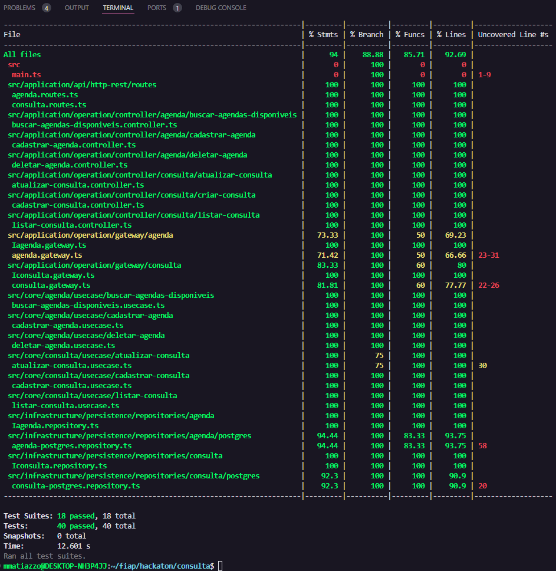

# Resultados dos Testes Unitários

[Voltar para documentação princpal](../README.md)

## Descrição

Este documento descreve os testes unitários realizados para o microsserviço de autenticação e consulta. O objetivo dos testes unitários é garantir que cada unidade de código funcione corretamente.

## Estrutura dos Testes

Os testes foram executados em diversos módulos e arquivos do projeto, abrangendo controladores, gateways, usecases e repositórios. A seguir, apresentamos uma visão geral dos resultados obtidos:

### Resumo Geral - Microsserviço de Autenticação
#### Cobertura de Código: 82,25%

- **Suítes de teste passadas**: 11
- **Testes passados**: 42


### Resumo Geral - Microsserviço de Consulta
#### Cobertura de Código: 92,69%

- **Suítes de teste passadas**: 18
- **Testes passados**: 40



## Execução dos Testes

Para executar os testes unitários, utilize o seguinte comando:

```bash
npm run test
```